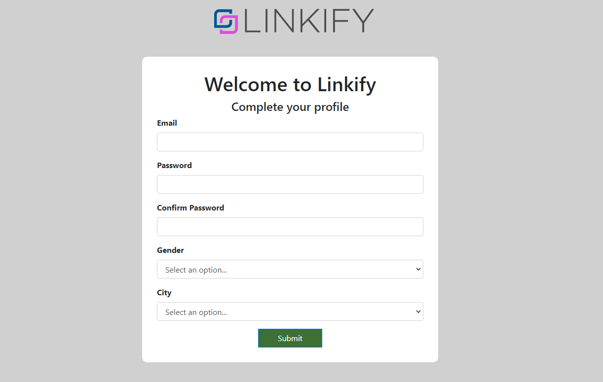

## Context

Estamos trabajando en el flujo de creación de usuarios y el
desarrollador encargado está de vacaciones.

Este es un pasó critico de nuestra plataformas y lo necesitamos ASAP!!!

Sigue los requerimientos e instrucciones para completar la tarea asignada.

## Installation

Baja este repo en tu pc y corre los siguientes comandos:

`npm install`

`npm start`

Ahora el sitio debería estar disponible en http://localhost:8080/index.html

## Requirements
### Profile Form
1. Valida que el formulario envíe los siguientes datos:
  * Email
  * Password
  * Gender
  * City (ver extra points)
  * Un hidden field con el nombre 'referal' y el valor de 'profile_page'
2. Asegurate que todos los field tengan un label y sigan la misma estructura.
3. Todos los fields son requeridos
4. Envía el formulario a success.html usando el método GET.

### Basic Styling
Necesitamos que ese formulario se vea bien!
Trata vea lo más parecido al diseño que nos enviaron.

1. Inserta el logo de Linkify en el header `logo.png`
2. El color de fondo del formulario debe ser `#d0d0d0`
2. El color del botton `Submit` debe ser `#3e6f33`

## Extra Points
1. Rellena el campo de ciudades
  * Usa la función `initForm` para crear las opciones de ciudades.
  * `cities` simula una respuesta de un API, limpia los resultados antes de crear las opciones.
  * Ordena las ciudades alfabeticamente.
2. Valida que los fields de passwords sean identicos antes de enviar el formulario. Puedes usar el método `handleSubmit` para esto.